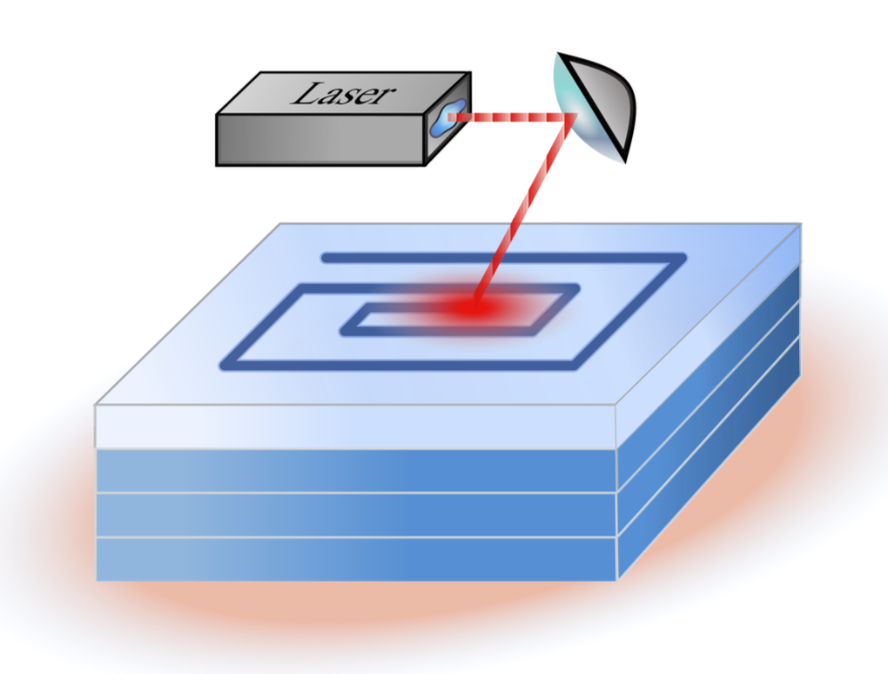
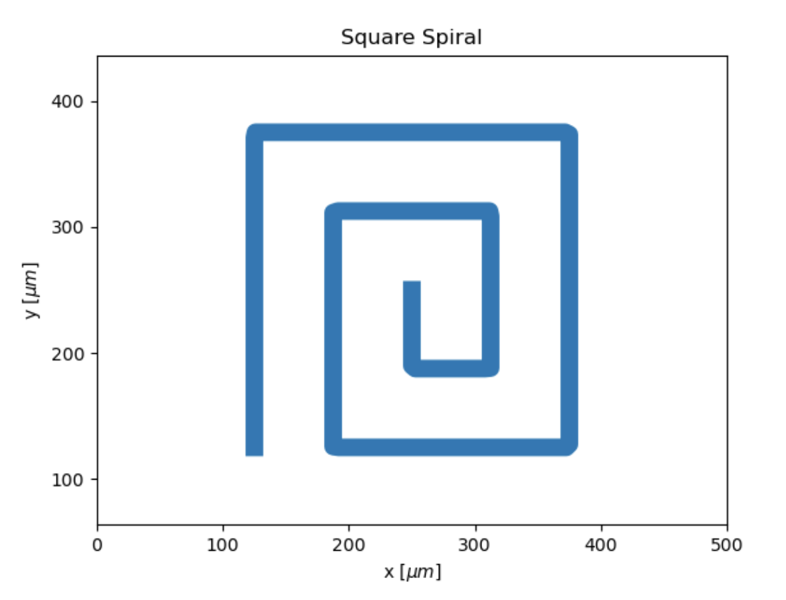

# SLM Controller

<p align="center">
  
  
</p>

Research code for modelling and controlling the temperature field in a
layer-by-layer selective laser melting (SLM) process.

## Background and recognition

This work builds on the SLM model developed in
[In-layer Thermal Control of a Multi-layer Selective Laser Melting Process](https://arxiv.org/html/2111.00890v2).
We gratefully acknowledge and thank its authors and all contributors to that
work.

The thesis behind this repository, *Multi-Layer Feedback Control for Selective
Laser Melting Using a Backpropagation Strategy*, received the
[Best BSc Thesis Award](https://ee.ethz.ch/news-and-events/d-itet-news-channel/2025/10/at-pbl-open-day-six-outstanding-students-honoured.html)
from the Department of Information Technology and Electrical Engineering
(D-ITET) at ETH Zürich.

The normal workflow is:

1. visualize a laser trajectory;
2. choose or edit an experiment YAML file;
3. train a controller;
4. evaluate its checkpoint and inspect the generated plot and metrics.

## Installation

Python 3.12 and [`uv`](https://docs.astral.sh/uv/) are used for reproducibility.
From the repository root, run:

```bash
uv sync --extra dev
uv run pytest
```

## 1. Plot a laser trajectory

```bash
uv run slm-plot-trajectory --figure square
```

This creates `figures/trajectories/square.png`. Available figures are:

```text
straight  circle  square  spiral  square_spiral  zigzag
```

Useful alternatives:

```bash
# Use the geometry and duration from an experiment configuration.
uv run slm-plot-trajectory --figure spiral \
  --config configs/experiments/single_layer.yaml

# Choose the output and also open an interactive window.
uv run slm-plot-trajectory --figure zigzag --output zigzag.png --show

# Equivalent script entry point.
uv run python scripts/plot_trajectory.py --figure circle
```

## 2. Train a controller

Training requires an experiment configuration, a layer scope, and a controller.

### Single layer

```bash
uv run slm-train \
  --config configs/experiments/single_layer.yaml \
  --layers single \
  --controller output_feedback \
  --epochs 500 \
  --learning-rate 0.001
```

The default checkpoint is
`artifacts/checkpoints/output_feedback_single.pt`. This reproduces the legacy
single-layer law `power[t] = gain[t] * output[t]` and its time-varying power
schedule.

### Multiple layers

The multilayer `error_feedback` workflow restores the specialized legacy
two-stage algorithm:

1. train the first layer with output feedback
   `u[1,t] = K_first[t] * y[1,t]`;
2. freeze its optimized power trajectory `u_bias[t]`;
3. use that trajectory as the bias on every later layer;
4. jointly train one time-varying gain schedule `K[t]`, shared by layers
   `2...L`, with
   `u[layer,t] = u_bias[t] + K[t] * (y[layer,t] - reference[t])`;
5. use only `u_bias[t]` for the first 10 samples of each later layer.

The reference remains the configured reference on every layer. The first-layer
output does **not** become the reference. Gradients propagate through cooling,
recoating, and ROI transitions, while the first-layer controller and bias stay
fixed during stage two.

```bash
uv run slm-train \
  --config configs/experiments/multilayer.yaml \
  --layers multi \
  --controller error_feedback \
  --first-layer-epochs 120 \
  --first-layer-learning-rate 8e-9 \
  --epochs 75 \
  --learning-rate 3e-6
```

The number of trained layers comes from `layers:` in the YAML file. The default
checkpoint is `artifacts/checkpoints/error_feedback_multi.pt`. It contains the
trained first-layer gains, frozen bias-power trajectory, shared later-layer
gains, both stage loss histories, and training hyperparameters. During stage
two, power-limit violations receive the legacy soft penalty; evaluation clips
applied power to the physical interval. Each stage-two update is accepted only
when its penalized objective is finite and non-increasing; an unsafe momentum
step is rejected and the learning rate is reduced.

The research-scale 25×25, eight-layer configuration is computationally
expensive because gradients are propagated through every layer and sample.
Use `small_test.yaml` to verify a workflow before starting the full run.

Trainable controller choices are:

- `open_loop`: optimizes one constant laser power;
- `output_feedback`: optimizes `power[t] = gain[t] * output[t]`, matching the
  legacy single-layer controller;
- `error_feedback`: for multiple layers, runs the legacy two-stage algorithm
  and shares one time-varying error-gain schedule across all later layers;
- `pi`: optimizes proportional and integral gains.

For a fast workflow check, substitute `configs/experiments/small_test.yaml` and
use a few epochs. It is not intended for scientific results.

```bash
uv run slm-train --config configs/experiments/small_test.yaml \
  --layers multi --controller pi --epochs 2 --learning-rate 0.001
```

The equivalent script is `scripts/train_controller.py`. Run any command with
`--help` to see the learning rates, stage epochs, feedback-start sample,
constraint penalty, and output arguments.

## 3. Evaluate a trained controller

Use the same configuration, layer scope, and controller type used for training:

```bash
uv run slm-evaluate \
  --config configs/experiments/multilayer.yaml \
  --layers multi \
  --controller error_feedback \
  --checkpoint artifacts/checkpoints/error_feedback_multi.pt
```

Evaluation rejects checkpoints with a different controller, layer scope,
number of layers, or time grid. A successful run separates numerical data from
generated images:

```text
results/<timestamp>_<experiment-name>/
├── config.yaml       # fully resolved configuration
├── history.pt        # state, output, power, time, and layer histories
└── metrics.json      # RMSE and run summary

figures/evaluations/
└── <timestamp>_<experiment-name>.png  # output, reference, and laser power
```

Use `--no-plot` to skip the evaluation figure. The equivalent script is
`scripts/evaluate_controller.py`.

To regenerate a figure from an existing run:

```bash
uv run python scripts/generate_figure.py results/<run>/history.pt
```

To evaluate the legacy-compatible single-layer controller:

```bash
uv run slm-evaluate \
  --config configs/experiments/single_layer.yaml \
  --layers single \
  --controller output_feedback \
  --checkpoint artifacts/checkpoints/output_feedback_single.pt
```

For a trained multilayer controller, the evaluation command shown at the start
of this section reconstructs both stages from the checkpoint automatically.

## Direct simulation without training

The controller and its initial values are read directly from the YAML:

```bash
uv run slm-single-layer --config configs/experiments/single_layer.yaml
uv run slm-multilayer --config configs/experiments/multilayer.yaml
```

## Editing configurations

Start from one of these annotated files:

- `configs/experiments/single_layer.yaml`
- `configs/experiments/multilayer.yaml`
- `configs/model/default.yaml`

The YAML comments list all path and controller choices and explain which
parameters apply to each controller. Keep new research experiments as new YAML
files rather than changing Python source code.

Important conventions:

- all internal values use SI units;
- state vectors are ordered from newest/top to oldest/bottom layer;
- state histories have shape `(time, state)`;
- `roi_layers` controls how many layer fields remain explicit;
- set `measurement_noise_std` and `seed` for reproducible noisy evaluation.

## Repository structure

```text
configs/              Annotated model and experiment YAML files
src/slm_control/      Reusable thermal model, controllers, training, simulation
scripts/              Script equivalents of the main workflows
tests/                Fast numerical and end-to-end tests
docs/                 Model, controller, and experiment documentation
artifacts/checkpoints Generated trained-controller checkpoints
results/              Generated numerical evaluation data
figures/              Generated plots grouped by plot type
legacy/               Complete pre-refactor implementation and results
```

Further details are in:

- [mathematical model](docs/mathematical_model.md)
- [controllers](docs/controllers.md)
- [experiment protocol](docs/experiments.md)
- [repository guide](docs/repository_guide.md)
